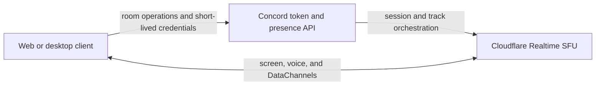

<p align="center">
  
</p>

<p align="center">
  <strong>English</strong> · <a href="README.pt-BR.md">Português do Brasil</a>
</p>

<p align="center">
  A private, lightweight room for sharing your screen, talking, and exchanging ephemeral messages.
</p>

<p align="center">
  <a href="https://github.com/Jovem-Blood/Concord/releases/latest"></a>
  <a href="https://github.com/Jovem-Blood/Concord/actions/workflows/release.yml"></a>
  
  
</p>

> [!NOTE]
> Concord is an early-stage project. Self-hosting requires your own Cloudflare Realtime Serverless SFU application.

## Why Concord?

Concord is designed for small groups that need a room quickly—not another account, community, or permanent workspace. A room is accessed through its code or invite link and combines screen sharing, voice, and ephemeral chat in the same focused interface.

- No accounts, camera, recording, message history, attachments, or direct messages.
- Web and desktop clients share the same Vue renderer and can join the same room.
- Media and DataChannels travel through Cloudflare Realtime; the Concord API does not receive chat contents.
- The desktop app is available for Windows and Linux, with a self-hostable web client.

## Features

- Create or join a private room by code or invite link.
- Share multiple screens at once, focus a stream, and see who is in the room.
- Native desktop source picker with monitor/window previews.
- `1080p30` motion and `1080p15` text-oriented capture profiles.
- Optional system audio, disabled by default.
- Real-time microphone audio, mute controls, room audio controls, and local speaking feedback.
- Reliable, ordered text chat with no persistence: up to 2,000 characters per message and 500 messages in memory.
- Automatic SFU session recovery, active-source republishing, and remote stream resubscription.
- Up to 16 participants per room.
- Portable ZIPs plus Windows NSIS and Linux AppImage releases.

## Download

Download the latest desktop build from [GitHub Releases](https://github.com/Jovem-Blood/Concord/releases/latest).

| Platform | Packages |
|---|---|
| Windows x64 | NSIS installer and portable ZIP |
| Linux x64 | AppImage and portable ZIP |
| Web | Self-hosted build from this repository |

Windows artifacts are currently unsigned and may trigger a Microsoft SmartScreen warning. Portable ZIP builds do not self-update; installed NSIS and AppImage builds check GitHub Releases for updates.

## How it works



Cloudflare provides sessions, tracks, and DataChannels—not Concord rooms. The Fastify API keeps room presence in memory, validates opaque participant tokens, and authorizes publishing and subscriptions. Clients negotiate WebRTC through the API, while media and text flow through the SFU.

Room sessions last up to two hours and expire after two minutes without activity. Run a single API instance unless you add shared coordination for room state.

## Quick start

### Requirements

- Node.js `22.12+` for development; Node.js 24 LTS is recommended and required by the release workflow.
- pnpm `10.15.0`.
- A Cloudflare Realtime Serverless SFU application.
- Windows 11 x64 for native Windows capture testing, or a current browser with `getDisplayMedia` and HTTPS outside localhost.

### 1. Configure the environment

Copy `.env.example` to `.env` without replacing an existing local file. Create an SFU application in **Cloudflare → Realtime → Serverless SFU**, then set:

```dotenv
CLOUDFLARE_SFU_APP_ID=your_app_id
CLOUDFLARE_SFU_APP_SECRET=your_app_secret
```

Never place secrets in a `VITE_` variable; those values are embedded into client builds.

### 2. Install and run

```sh
pnpm install
pnpm dev:server
```

In another terminal, start either client:

```sh
pnpm dev:web       # http://localhost:5173
pnpm dev:desktop   # Electron
```

An invite such as `http://localhost:5173/ABCD2345` prepares the client to join that room.

### Docker

```sh
docker compose up --build
```

Open `http://localhost:4173`. The single Compose file loads the root `.env` automatically and binds both services to loopback. There is no local SFU emulator: development media still uses Cloudflare. Unit tests use an SFU mock and need no credentials.

### Production through a tunnel

Run `./scripts/setup-self-host.sh concord.example.com` to prepare new environment files, fill in the SFU credentials, then start the same Compose file with `docker compose up -d --build`. The tunnel terminates HTTPS and replaces an additional reverse proxy. Route requests as follows:

| Public route | Origin on the host |
|---|---|
| `/health`, `/v1/*` | `http://127.0.0.1:3001` |
| All other routes | `http://127.0.0.1:4173` |

Do not cache `/v1/*`. If the tunnel does not support path-based routing, use a separate API hostname and set `PUBLIC_SERVER_URL` before building. `ALLOWED_ORIGINS` must include the public web origin. A tunnel running in a container can join the Compose network and use `http://server:3001` and `http://web:4173` directly.

Run exactly one `server` instance: room presence, tokens, and publications are kept in memory, and restarting it ends the active room sessions.

## Configuration

| Variable | Purpose |
|---|---|
| `CLOUDFLARE_SFU_APP_ID` | Required server-side SFU application ID |
| `CLOUDFLARE_SFU_APP_SECRET` | Required server-side SFU application secret |
| `ALLOWED_ORIGINS` | Comma-separated web origins accepted by the API |
| `PORT` | API port; defaults to `3001` |
| `PUBLIC_APP_URL` | Public web URL used by Docker Compose |
| `PUBLIC_SERVER_URL` | Public API URL embedded in the Compose web build |
| `VITE_SERVER_URL` | API URL embedded in the client |
| `VITE_WEB_APP_URL` | Base URL used by desktop invite links |

Concord uses Cloudflare STUN and does not configure a TURN relay. Networks that require relay connectivity are therefore unsupported. Web capture audio availability depends on the browser, operating system, and selected source; video continues with a warning when audio is unavailable.

## Development

```sh
pnpm typecheck
pnpm test
pnpm lint
pnpm build
pnpm make
```

The web build is written to `apps/client/dist-web`. `pnpm make` builds release artifacts for the current operating system and requires Node.js 22.12 through 24.x; Node.js 24 LTS is recommended.

Useful project references:

- [Manual test checklist](docs/manual-test-checklist.md)
- [Design guide](design.md)
- [Contributing guide](CONTRIBUTING.md)
- [Security policy](SECURITY.md)

## Releases

SemVer tags such as `v0.1.0` trigger `.github/workflows/release.yml`. The tag must match `apps/client/package.json` and point to a commit contained in `main`. The workflow verifies the project, builds Windows and Linux artifacts, generates SHA-256 checksums, and publishes a GitHub Release.

## Privacy and security

Electron runs with `nodeIntegration: false`, `contextIsolation: true`, sandboxing, and a restrictive Content Security Policy. Its preload exposes only capture operations. Capture selections are tied to the requesting window, expire after ten seconds, and are consumed once.

The microphone is requested only after the user presses its control and never enables a camera. Messages are erased on every reconnect and are never recovered. Token expiry or persistent connection failure stops all active capture and requires joining again.

Please report vulnerabilities privately according to [SECURITY.md](SECURITY.md).

## Deliberate limits

Concord does not currently provide cameras, user accounts, recording, persistent history, attachments, direct messages, process-specific Windows audio, or automatic multi-instance API coordination. The current implementation uses one video layer with profile-specific bitrate limits rather than simulcast.

## Contributing

Issues and pull requests are welcome. Read [CONTRIBUTING.md](CONTRIBUTING.md) before starting, and use the manual checklist for changes involving capture, media, or cross-device behavior.

## License

No open-source license has been selected yet. Until a license is added, the source is publicly visible but all rights remain reserved.
