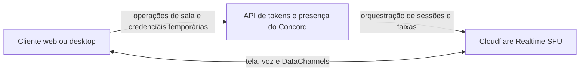

<p align="center">
  
</p>

<p align="center">
  <a href="README.md">English</a> · <strong>Português do Brasil</strong>
</p>

<p align="center">
  Uma sala privada e leve para compartilhar sua tela, conversar por voz e trocar mensagens efêmeras.
</p>

<p align="center">
  <a href="https://github.com/Jovem-Blood/Concord/releases/latest"></a>
  <a href="https://github.com/Jovem-Blood/Concord/actions/workflows/release.yml"></a>
  
  
</p>

> [!NOTE]
> O Concord está em fase inicial. A hospedagem própria exige um aplicativo Cloudflare Realtime Serverless SFU.

## Por que Concord?

O Concord foi feito para pequenos grupos que precisam de uma sala rapidamente — não de mais uma conta, comunidade ou espaço permanente. O acesso acontece por código ou link de convite e reúne compartilhamento de tela, voz e chat efêmero em uma interface focada.

- Sem contas, câmera, gravação, histórico de mensagens, anexos ou mensagens diretas.
- Clientes web e desktop usam o mesmo renderer Vue e entram na mesma sala.
- Mídia e DataChannels passam pela Cloudflare Realtime; a API do Concord não recebe o conteúdo do chat.
- O aplicativo desktop está disponível para Windows e Linux, com cliente web auto-hospedável.

## Recursos

- Criação e entrada em sala privada por código ou link de convite.
- Várias telas simultâneas, foco em um stream e lista de participantes.
- Seletor nativo de fontes no desktop com miniaturas de monitores e janelas.
- Perfis de captura `1080p30` para movimento e `1080p15` para texto.
- Áudio do sistema opcional, desligado por padrão.
- Microfone em tempo real, mute, silenciar sala e indicador local de fala.
- Chat de texto confiável e ordenado, sem persistência: até 2.000 caracteres por mensagem e 500 mensagens em memória.
- Recuperação automática da sessão SFU, republicação das fontes ativas e reassinatura dos streams remotos.
- Até 16 participantes por sala.
- ZIPs portáteis, instalador NSIS para Windows e AppImage para Linux.

## Download

Baixe a versão desktop mais recente em [GitHub Releases](https://github.com/Jovem-Blood/Concord/releases/latest).

| Plataforma | Pacotes |
|---|---|
| Windows x64 | Instalador NSIS e ZIP portátil |
| Linux x64 | AppImage e ZIP portátil |
| Web | Build auto-hospedado deste repositório |

Os artefatos do Windows ainda não são assinados e podem exibir um aviso do Microsoft SmartScreen. Os ZIPs portáteis não se atualizam sozinhos; instalações NSIS e AppImage verificam novas versões no GitHub Releases.

## Como funciona



A Cloudflare fornece sessões, faixas e DataChannels — não as salas do Concord. A API Fastify mantém a presença em memória, valida tokens opacos por participante e autoriza publicação e assinatura. Os clientes negociam WebRTC pela API, enquanto mídia e texto seguem pelo SFU.

As sessões duram até duas horas e expiram após dois minutos sem atividade. Execute uma única instância da API, a menos que seja adicionada coordenação compartilhada para o estado das salas.

## Início rápido

### Requisitos

- Node.js `22.12+` para desenvolvimento; Node.js 24 LTS é recomendado e usado no workflow de release.
- pnpm `10.15.0`.
- Um aplicativo Cloudflare Realtime Serverless SFU.
- Windows 11 x64 para testes de captura nativa no Windows, ou navegador atual com `getDisplayMedia` e HTTPS fora de localhost.

### 1. Configure o ambiente

Copie `.env.example` para `.env` sem substituir um arquivo local existente. Crie um aplicativo em **Cloudflare → Realtime → Serverless SFU** e defina:

```dotenv
CLOUDFLARE_SFU_APP_ID=seu_app_id
CLOUDFLARE_SFU_APP_SECRET=seu_app_secret
```

Nunca coloque segredos em variáveis `VITE_`; esses valores são incorporados aos builds do cliente.

### 2. Instale e execute

```sh
pnpm install
pnpm dev:server
```

Em outro terminal, inicie um dos clientes:

```sh
pnpm dev:web       # http://localhost:5173
pnpm dev:desktop   # Electron
```

Um convite como `http://localhost:5173/ABCD2345` prepara o cliente para entrar nessa sala.

### Docker

```sh
docker compose up --build
```

Abra `http://localhost:4173`. O Docker Compose carrega o `.env` da raiz automaticamente. Não há emulador SFU local: a mídia de desenvolvimento também usa a Cloudflare. Os testes unitários usam um SFU simulado e não precisam de credenciais.

## Configuração

| Variável | Uso |
|---|---|
| `CLOUDFLARE_SFU_APP_ID` | Identificador obrigatório do aplicativo SFU no servidor |
| `CLOUDFLARE_SFU_APP_SECRET` | Segredo obrigatório do aplicativo SFU no servidor |
| `ALLOWED_ORIGINS` | Origens web aceitas pela API, separadas por vírgula |
| `PORT` | Porta da API; padrão `3001` |
| `PUBLIC_APP_URL` | URL pública do web usada pelo Docker Compose |
| `PUBLIC_TOKEN_SERVER_URL` | URL pública da API incorporada ao build web do Compose |
| `CLOUDFLARE_TURN_KEY_ID` | Chave TURN opcional para redes restritivas |
| `CLOUDFLARE_TURN_API_TOKEN` | Token privado para gerar credenciais TURN temporárias |
| `CLOUDFLARE_TURN_TTL_SECONDS` | Validade TURN; padrão `7200`, máximo `172800` |
| `VITE_TOKEN_SERVER_URL` | URL da API incorporada ao cliente |
| `VITE_WEB_APP_URL` | URL-base usada nos convites copiados pelo desktop |

Sem TURN configurado, o Concord usa STUN da Cloudflare. Com TURN, conexões diretas continuam permitidas. A disponibilidade de áudio na captura web depende do navegador, sistema operacional e fonte escolhida; quando o áudio não está disponível, o vídeo continua com um aviso.

## Desenvolvimento

```sh
pnpm typecheck
pnpm test
pnpm lint
pnpm build
pnpm make
```

O build web fica em `apps/desktop/dist-web`. `pnpm make` gera artefatos de release para o sistema operacional atual e exige Node.js 22.12 a 24.x; Node.js 24 LTS é recomendado.

Referências úteis do projeto:

- [Lista de testes manuais](docs/manual-test-checklist.md)
- [Infraestrutura e deploy em produção](infra/README.md)
- [Guia de design](design.md)
- [Guia de contribuição](CONTRIBUTING.md)
- [Política de segurança](SECURITY.md)

## Releases

Tags SemVer como `v0.1.0` executam `.github/workflows/release.yml`. A tag deve corresponder a `apps/desktop/package.json` e apontar para um commit presente em `main`. O workflow verifica o projeto, cria os artefatos de Windows e Linux, gera checksums SHA-256 e publica uma GitHub Release.

## Privacidade e segurança

O Electron usa `nodeIntegration: false`, `contextIsolation: true`, sandbox e uma Content Security Policy restritiva. O preload expõe apenas operações de captura. Seleções de fonte são vinculadas à janela solicitante, expiram em dez segundos e são consumidas uma vez.

O microfone é solicitado somente quando o usuário pressiona o controle e nunca ativa uma câmera. Mensagens são apagadas a cada reconexão e nunca são recuperadas. Expiração de token ou falha persistente de conexão encerra todas as capturas e exige uma nova entrada.

Relate vulnerabilidades de forma privada conforme [SECURITY.md](SECURITY.md).

## Limites intencionais

O Concord não oferece atualmente câmera, contas de usuário, gravação, histórico persistente, anexos, mensagens diretas, áudio de um processo específico no Windows ou coordenação automática entre várias instâncias da API. A implementação atual usa uma camada de vídeo com limites de bitrate por perfil, sem simulcast.

## Como contribuir

Issues e pull requests são bem-vindos. Leia [CONTRIBUTING.md](CONTRIBUTING.md) antes de começar e use a lista manual para mudanças que envolvam captura, mídia ou comportamento entre dispositivos.

## Licença

Ainda não foi escolhida uma licença open source. Até que uma licença seja adicionada, o código-fonte está publicamente visível, mas todos os direitos permanecem reservados.
